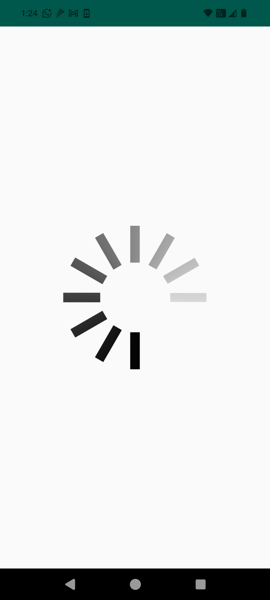

# 🚀 Version 2.1.4

**Release Date:** 28 Aug 2025  
**Updated:** 28 Aug 16:31 PM

---

## What's New

- Added Portfolio FD Categorization
- Added Add to Cart feature in MFU
- Added Credit against MF in Broker Login
- Added filter on SIP Summary
- Added New Nominee details in BSE / NSE / MFU
- Added birth proof certificate in BSE for Minors
- Added profile edit in Broker Login

---

## Bug Fixes

- Fixed dividend frequency while placing order in MFU
- Fixed default bank issue while placing order in NSE
- Fixed other crashes and bugs

---

## New Features

### Custom Splash Screen


```java 
 MintSDK mintSDK = new MintSDK(this);
        mintSDK.configureSDK(true,R.drawable.loadingtest);
 // TODO: image supported jpg,png and gif 
 // TODO : image is option
 // TODO: pass 0 or null for default splash screen  

```
**Supported formats:**

```
jpg
png
gif
```

Pass 0 or null for default splash.

## Status Bar Configuration
```xml

<color name="colorStatusBar">@color/transparent</color>
<color name="colorStatusBarDark">@color/transparent</color>
```

SDK Build Configuration

Gradle version:

gradle-8.13

Kotlin version:

2.2.0

AGP version:

8.6.1

---


## Custom Splash screen:



**Note:** pass transparent color for the default statusbar in your app **colors.xml**


```xml
<color name="colorStatusBar">@color/transparent</color>
    <color name="colorStatusBarDark">@color/transparent</color>

```


Mint SDK Compile uses:

**gradlew-wrapper.properties**

```
distributionUrl=https\://services.gradle.org/distributions/gradle-8.13-bin.zip

```

2. Kotlin Version 2.2.0

