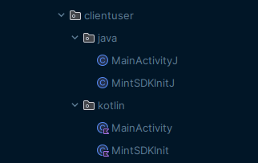
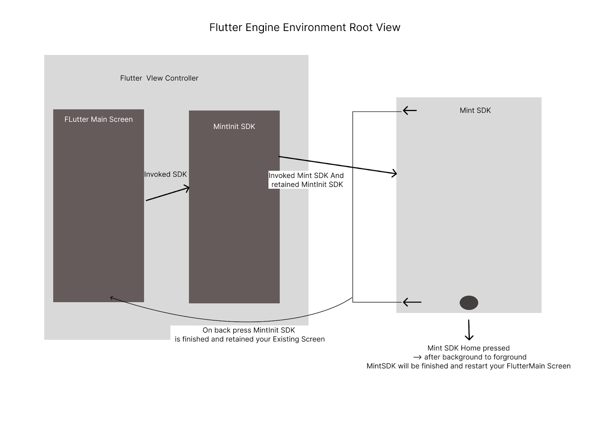

Mint SDK for Flutter implementation
Note: Flutter version below 3.8.0
✅ Build artifacts: 2.1.5 for android 10 or below support (handled back press)
✅ Build artifacts: 1.1.16aar
1.0.02beta introduce a new method
invokeMintSDKForFlutter()
Accepting arguments

1. Sso
2. fcmToken
3. domain

**Step1.** Create a dart class **MintUtils**

```
class MintUtils{
static const platform = const MethodChannel('mint-android-app');
}
// for checking current client isAndroid return true 
bool isPlatformAndroid() {
return Platform.isAndroid;
}

```

**Step2**. Create a dart function where you want to invoke mintSDK

```
// click on button 
 final result = await _checkNativeLibrary();
            if(!result){
 // call SSOToken API 
              generateAuth("");
            }
 //  add this class member function for check is available session or not  
 // note in case of available session mint  will return true and will open the respective user logedin 
 Future<bool> _checkNativeLibrary() async {
    try {
      final result = await platform.invokeMethod('isValidAuth');
      return result as bool;
    } catch (e) {
      print('Error: $e');
      return false;
    }
  }
  // note while app is logging-out call this function _clearMintSDKData
  Future<void> _clearMintSDKData() async {
    try {
     if (isPlatformAndroid()) {
      await platform.invokeMethod('clearSession');
      }else{
      await platform.invokeMethod('clearSession');
          }
    } catch (e) {
      print('Error: $e');
    }
  }
void openMintLib(Map<String, String> jsonArray) async {
    try {
      try {
        if (isPlatformAndroid()) {
          await MintUtils.platform.invokeMethod('openMintLib', jsonArray);
        } else {
          await MintUtils.platform.invokeMethod('openMintLibIOS', jsonArray);
        }
      } catch (e) {}
    } catch (e) {
      print('Error: $e');
    }
  }

```

#### in this jsonArray you will pass
'**ssoToken**':'**SSOToken**'

```dart
      'ssoToken':'SSOToken',
          'fcmToken':'your_fcm_token',
          'Domain':'your_domain'
```

**Step3:** implement channel methods at your **MainActivity.kt**

```kotlin
private val CHANNEL = "mint-android-app"
 companion object{
        var sdkInitialized:Boolean?=false
    }
```

**Step 4**. Implement this code in oncreate()
GeneratedPluginRegistrant.registerWith(FlutterEngine(this))

```kotlin

   GeneratedPluginRegistrant.registerWith(FlutterEngine(this))
        flutterEngine?.dartExecutor?.binaryMessenger?.let {  MethodChannel(it,CHANNEL).setMethodCallHandler { call, result ->
            if (call.method == "openMintLib") {
                try {
                    var domain =""
                    var sso =""
                    var fcm =""
                    val argumentsString: String? = call.arguments?.toString()
                    val tokenResponse = JSONObject(call.arguments.toString())
                    if (tokenResponse.toString().isEmpty()){
                        argumentsString.let { jsonString->
                            try {
                                val newResponse = JSONObject(jsonString)
                                domain = newResponse.optString("domain")
                                sso = newResponse.optString("ssoToken")
                                fcm = newResponse.optString("fcmToken")
                            }catch (e:Exception){e.printStackTrace()}
                        }
                    }else{
                        domain = tokenResponse.optString("domain")
                        sso = tokenResponse.optString("ssoToken")
                        fcm = tokenResponse.optString("fcmToken")
                    }
                    mintSDK.setIsProduction(false);
                      // Note: please use package name with class name like this 
                      //com.example.mintsample.MainActivity
mintSDK.invokeMintSDK(
                sso,
                fcm/*firebase Token*/,
                domain,
                "your_package"
        );
                    result.success("Success")
                }catch (e: JSONException) {
                    // Handle JSON parsing error
                    result.error("JSON Parsing Error", e.message, null)
                }
            } if (call.method == "isValidAuth"){
           handleAuthCheck(result)
}  if (call.method == "clearSession"){
clearSDK()
}else {
                result.notImplemented()
            }
        } 
        // add this function to handle the existing session 
         private fun handleAuthCheck(result: MethodChannel.Result) {
         // default splash creen please use null
        mintSDK.configureSDK(true,null)
        // use while you have custom splash
    mintSDK.configureSDK(true,R.drawable.your_splash_image)
    // set enviroment for release true, false for debug 
            mintSDK.setIsProduction(false);
    result.success(mintSDK.isAuthValidated)
  }
  private fun clearSDK(){
   mintSDK.clearSDKData()
}
}

```


**Step 5.**
Create a new activity MintSDKInit with binding

```groovy
  buildFeatures {
        dataBinding = true
    }
```

Add launchmode

```xml
   android:launchMode="singleInstancePerTask"
```

Note: Do not use MintSDkInit class in sdk version 2.1.5 or above
Create an Activity class in your flutter android module**MintSDKInit Activity:**


```kotlin

class MintSDKInit: FlutterActivity() {
    lateinit var binding: ActivitySdkInitBinding
    override fun onCreate(savedInstanceState: Bundle?) {
        super.onCreate(savedInstanceState)
        binding = DataBindingUtil.setContentView(this@MintSDKInit,R.layout.activity_sdk_init)
//        setContentView(R.layout.activity_sdk_init)
        getBundles()
    }
    private fun getBundles(){
       if (intent !=null && intent.hasExtra("route") && MainActivity.sdkInitialized==true){
           val domain :String = intent.getStringExtra("domain")!!
           val fcm :String= intent.getStringExtra("fcm")!!
           val sso :String= intent.getStringExtra("sso")!!
MainActivity.sdkInitialized=false
           invokeSDK(sso = sso, fcmToken = fcm, domain = domain)
       }else{
           // remove activity
    if(MainActivity.sdkInitialized==false){
                startActivity(Intent(this,MainActivity::class.java))
    finish()
}else{
finish()
}
       }
    }
    private fun invokeSDK(sso: String,fcmToken:String,domain:String,classWithPackage:String= "${this@MintSDKInit.packageName}.MintSDKInit") {
        val mintSdk = MintSDK(this@MintSDKInit)
        mintSDk.configureSDK(true,R.drawable.loadingtest)
        // set enviroment for release true, false for debug 
            mintSDK.setIsProduction(true);
        mintSdk.invokeMintSDKForFlutter(sso,fcmToken,domain)
    }
    override fun onBackPressed() {
        super.onBackPressed()
    removeAllkeys()
        finish()
    }
 private fun checkBackStack(){
        val taskStackBuilder = TaskStackBuilder.create(this@MintSDKInit)
        taskStackBuilder.addNextIntentWithParentStack(
            Intent(this@MintSDKInit, MainActivity::class.java)
        )
        taskStackBuilder.startActivities()
    }
    override fun onPause() {
        super.onPause()
        removeAllKeys()
    }
    override fun onDestroy() {
        super.onDestroy()
        removeAllKeys()
    }
    private fun removeAllKeys(){
        if (intent.hasExtra("route")){
            intent.removeExtra("route")
//            intent.removeFlags(Intent.FLAG_ACTIVITY_CLEAR_TASK)
        }
    }
}

```


**Tips:** Do not use MintSDkInit in sdk version 2.1.5 or above
com.github.investwell-tools:mint-android-app:2.1.5
Code brief: Code Language Specification & Implementation




**Use the above reference code as per your default language(Kotlin/java) Checkout Flutter Engine Root View controller for Android**




Kotlin:
Your Default MainActivity when you are using Kotlin add this code snippet


```kotlin

package com.example.clientuser.kotlin
import android.content.Intent
import android.os.Build
import android.os.Bundle
import android.widget.Toast
import androidx.core.app.TaskStackBuilder
import investwell.utils.AppSession
import io.flutter.embedding.android.FlutterFragmentActivity
import io.flutter.embedding.engine.FlutterEngine
import io.flutter.plugin.common.MethodChannel
import io.flutter.plugins.GeneratedPluginRegistrant
import org.json.JSONException
import org.json.JSONObject
import java.lang.Exception
class MainActivity: FlutterFragmentActivity() {
    private val CHANNEL = "mint-android-app"
    private var msession: AppSession?= null
    companion object{
        var sdkInitialized:Boolean?=false
    }
    override fun onCreate(savedInstanceState: Bundle?) {
        // Aligns the Flutter view vertically with the window.
//        WindowCompat.setDecorFitsSystemWindows(getWindow(), false)
        showToast("OnCreate")
        if (Build.VERSION.SDK_INT >= Build.VERSION_CODES.S) {
            // Disable the Android splash screen fade out animation to avoid
            // a flicker before the similar frame is drawn in Flutter.
            splashScreen.setOnExitAnimationListener { splashScreenView -> splashScreenView.remove() }
        }
        msession = AppSession(this@MainActivity)
        super.onCreate(savedInstanceState)
        // mintSDK Invoke
//        invoke()
        GeneratedPluginRegistrant.registerWith(FlutterEngine(this))
        flutterEngine?.dartExecutor?.binaryMessenger?.let {  MethodChannel(it,CHANNEL).setMethodCallHandler { call, result ->
            if (call.method == "openMintLib") {
                try {
                    var domain =""
                    var sso =""
                    var fcm =""
                    val argumentsString: String? = call.arguments?.toString()
                    val tokenResponse = JSONObject(call.arguments.toString())
                    if (tokenResponse.toString().isEmpty()){
                        argumentsString.let { jsonString->
                            try {
                                val newResponse = JSONObject(jsonString)
                                domain = newResponse.optString("domain")
                                sso = newResponse.optString("ssoToken")
                                fcm = newResponse.optString("fcmToken")
                            }catch (e:Exception){e.printStackTrace()}
                        }
                    }else{
                        domain = tokenResponse.optString("domain")
                        sso = tokenResponse.optString("ssoToken")
                        fcm = tokenResponse.optString("fcmToken")
                    }
//                    invokeSDK(sso,fcm,domain)
//                    invoke(sso, fcmToken = fcm, domain = domain)
                     mintSDK.configureSDK(true,R.drawable.loadingtest);
                     // Note Please use your package name like this com.example.mintsample.MainActivity
                        mintSDK.invokeMintSDK(
                sso,
                fcm/*firebase Token*/,
                domain,
                "your_app_package_with_className"
        );
                    result.success("Success")
                }catch (e: JSONException) {
                    // Handle JSON parsing error
                    result.error("JSON Parsing Error", e.message, null)
                }
            }if (call.method == "isValidAuth") {
            handleAuthCheck(result);
} if (call.method == "clear"){
clearSDKData();
}else {
                result.notImplemented()
            }
        } }
    }
    private void clearSDKData(){
     mintSDK.clearSDKData();
}
    private void handleAuthCheck(MethodChannel.Result result){
     mintSDK.configureSDK(true,R.drawable.loadingtest);
     // set enviroment for release true, false for debug 
            mintSDK.setIsProduction(true);
    result.success(mintSDK.isAuthValidated());
}
    override fun onStart() {
        showToast("onStart")
        super.onStart()
    }
    override fun onResume() {
        showToast("onResume")
        super.onResume()
    }
    override fun onRestart() {
        showToast("onRestart")
        super.onRestart()
    }
    override fun onPause() {
        showToast("onPause")
        super.onPause()
    }
    override fun onStop() {
        showToast("onStop")
        super.onStop()
    }
    override fun onDestroy() {
        showToast("onDestroy")
        super.onDestroy()
    }
    fun showToast(message:String?){
        println("SDK App                               </comment> $message")
        Toast.makeText(this@MainActivity,"SDK App                               </comment> $message",Toast.LENGTH_SHORT).show()
    }
}

```


**Tips:** Do not use this Mint SDK 2.1.5 or above

```xml

            android:name=".kotlin.MintSDKInit"
            android:exported="false"
            android:launchMode="singleInstancePerTask"
            android:parentActivityName=".kotlin.MainActivity"

```

Java:
: Your Default MainActivity when you are using Kotlin add this code snippet


```java

package com.example.clientuser.java;
import android.content.Intent;
import android.os.Build;
import android.os.Bundle;
import android.os.PersistableBundle;
import androidx.annotation.NonNull;
import androidx.annotation.Nullable;
import org.json.JSONException;
import org.json.JSONObject;
import investwell.utils.AppSession;
import io.flutter.embedding.android.FlutterFragmentActivity;
import io.flutter.embedding.engine.FlutterEngine;
import io.flutter.plugin.common.MethodChannel;
import io.flutter.plugins.GeneratedPluginRegistrant;
public class MainActivityJ extends FlutterFragmentActivity {
    private static final String CHANNEL = "mint-android-app";
    private AppSession mSession;
    public static Boolean sdkInitialized = false;
    @Override
    public void onCreate(@Nullable Bundle savedInstanceState, @Nullable PersistableBundle persistentState) {
        super.onCreate(savedInstanceState, persistentState);
        if (Build.VERSION.SDK_INT >= Build.VERSION_CODES.S) {
            // Disable the Android splash screen fade out animation to avoid
            // a flicker before the similar frame is drawn in Flutter.
            getSplashScreen().setOnExitAnimationListener(splashScreenView -> splashScreenView.remove());
        }
//        GeneratedPluginRegistrant.registerWith(new FlutterEngine(this));
    }
    @Override
    public void configureFlutterEngine(@NonNull FlutterEngine flutterEngine) {
        super.configureFlutterEngine(flutterEngine);
        GeneratedPluginRegistrant.registerWith(flutterEngine);
        new MethodChannel(flutterEngine.getDartExecutor().getBinaryMessenger(),CHANNEL).setMethodCallHandler((call, result) -> {
            if (call.method.equals("openMintLib")) {
                try {
                    // Initialize variables
                    String domain = "";
                    String sso = "";
                    String fcm = "";
                    // Parse the arguments from the call
                    JSONObject tokenResponse = new JSONObject(call.arguments.toString());
                    // Extract values from tokenResponse or arguments
                    if (tokenResponse.length() == 0) {
                        // If tokenResponse is empty, try to parse arguments string
                        String argumentsString = call.arguments.toString();
                        try {
                            JSONObject newResponse = new JSONObject(argumentsString);
                            domain = newResponse.optString("domain", "");
                            sso = newResponse.optString("ssoToken", "");
                            fcm = newResponse.optString("fcmToken", "");
                        } catch (JSONException e) {
                            result.error("JSON Parsing Error", "Failed to parse arguments: " + e.getMessage(), null);
                            return; // Exit early if parsing fails
                        }catch (Exception e) {
                            result.error("JSON Parsing Error", "Failed to parse arguments: " + e.getMessage(), null);
                            return;
                        }
                    } else {
                        // Extract values directly from tokenResponse
                        domain = tokenResponse.optString("domain", "");
                        sso = tokenResponse.optString("ssoToken", "");
                        fcm = tokenResponse.optString("fcmToken", "");
                    }
                    // Prepare and start the MintSDKInit activity
                    Intent intentsdk = new Intent(this, MintSDKInitJ.class);
                    intentsdk.putExtra("route", "main");
//                    intentsdk.addFlags(Intent.FLAG_ACTIVITY_CLEAR_TOP | Intent.FLAG_ACTIVITY_PREVIOUS_IS_TOP);
                    intentsdk.putExtra("sso", sso);
                    intentsdk.putExtra("domain", domain);
                    intentsdk.putExtra("fcm", fcm);
                    sdkInitialized = true;
                    // add your current activity like this 
                    mSession = new AppSession(this);
                    mSession.setCallFromPackage("com.example.clientuser.java.MainActivityJ");
                    if (Build.VERSION.SDK_INT < Build.VERSION_CODES.S) {
                        // For below Android 12, use TaskStackBuilder to preserve the stack
                        TaskStackBuilder.create(this)
                                .addNextIntentWithParentStack(intentsdk)
                                .startActivities();
                    } else {
                        // For Android 12 and above, use the standard startActivity
                        startActivity(intentsdk);
                    }
                    result.success("Success");
                } catch (JSONException e) {
                    // Handle JSON parsing error for tokenResponse
                    result.error("JSON Parsing Error", "Failed to parse token response: " + e.getMessage(), null);
                }
            }else if ("clearSession"){
            logout();
}  else if ("isValidAuth"){
checkValidAuth();
}else {
                result.notImplemented();
            }
        });
    }
private void checkValidAuth(){
mintSDK.configureSDK(true,R.drawable.loadingtest);
    result.success(mintSDK.isAuthValidated);
}
    private void logout(){
     mintSDK.clearSDKData();
}
}

```
MintSDKInitJ.java (DO not use this class SDK 2.1.5 or above )

```java
package com.example.clientuser.java;
import android.app.TaskStackBuilder;
import android.content.Intent;
import android.os.Bundle;
import com.example.clientuser.kotlin.MainActivity;
import com.example.clientuser.R;
import investwell.sdk.MintSDK;
import io.flutter.embedding.android.FlutterActivity;
public class MintSDKInitJ extends FlutterActivity {
    @Override
    protected void onCreate(Bundle savedInstanceState) {
        super.onCreate(savedInstanceState);
        setContentView(R.layout.activity_mint_sdkinit);
        getBundles();
    }
    private void getBundles() {
        if (getIntent() != null && getIntent().hasExtra("route") && MainActivityJ.sdkInitialized ==true) {
            String domain = getIntent().getStringExtra("domain");
            String fcm = getIntent().getStringExtra("fcm");
            String sso = getIntent().getStringExtra("sso");
            MainActivityJ.sdkInitialized = false;
            invokeSDK(sso, fcm, domain);
        } else {
            // Remove activity
            if (!MainActivityJ.sdkInitialized) {
//                 startActivity(new Intent(this, MainActivityJ.class));
//                 finish();
                     Intent intent = new Intent(this, MainActivityJ.class);
                // Use TaskStackBuilder to maintain the back stack when going back to MainActivityJ
                TaskStackBuilder.create(this)
                        .addNextIntentWithParentStack(intent)
                        .startActivities();
                finish();
            } else {
                finish();
            }
        }
    }
    private void invokeSDK(String sso, String fcmToken, String domain) {
        MintSDK mintSdk = new MintSDK(this);
         mintSDk.configureSDK(true,R.drawable.loadingtest);
  // set enviroment for release true, false for debug 
            mintSDK.setIsProduction(true);
        mintSdk.invokeMintSDKForFlutter(sso, fcmToken, domain);
    }
    @Override
    public void onBackPressed() {
        checkBackStack();
        removeAllKeys();
        finish();
    }
    private void checkBackStack() {
        TaskStackBuilder taskStackBuilder = TaskStackBuilder.create(this);
        taskStackBuilder.addNextIntentWithParentStack(new Intent(this, MainActivity.class));
        taskStackBuilder.startActivities();
    }
    @Override
    protected void onPause() {
        super.onPause();
        removeAllKeys();
    }
    @Override
    protected void onDestroy() {
        super.onDestroy();
        removeAllKeys();
    }
    private void removeAllKeys() {
        if (getIntent().hasExtra("route")) {
            getIntent().removeExtra("route");
            // Uncomment if you want to clear the task flags
            // getIntent().removeFlags(Intent.FLAG_ACTIVITY_CLEAR_TASK);
        }
    }
}

```


Note: call the function while your app is log out / clear SDK session

```dart
 Future<void> _clearMintSDKData() async {
    try {
      await platform.invokeMethod('clear');
    } catch (e) {
      print('Error: $e');
    }
  }

```

